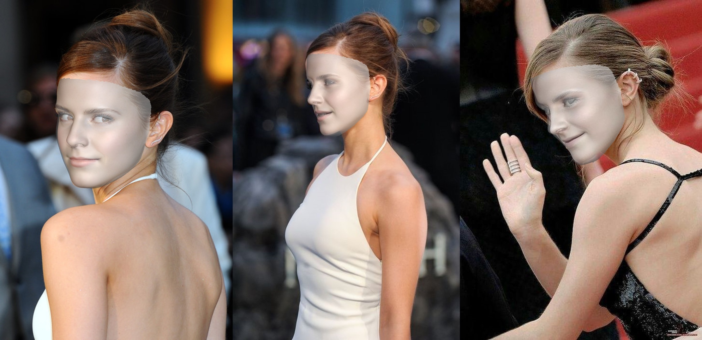
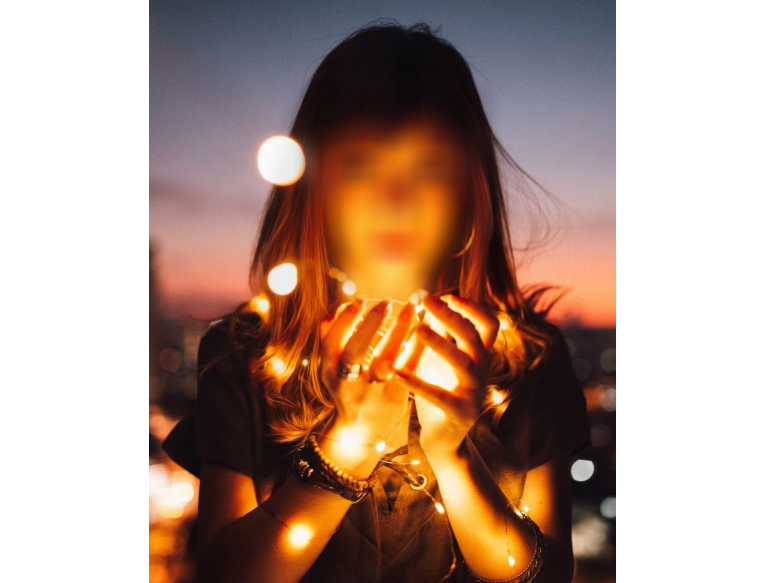
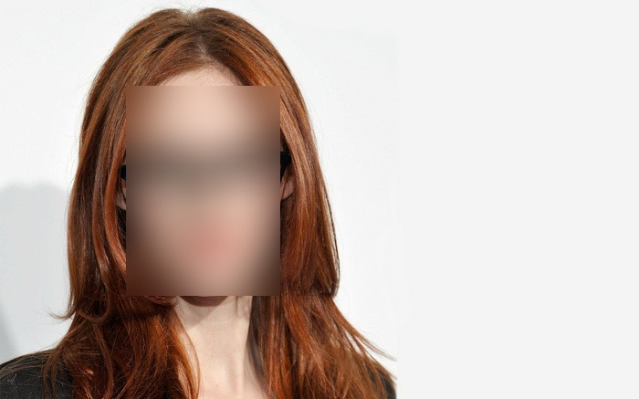
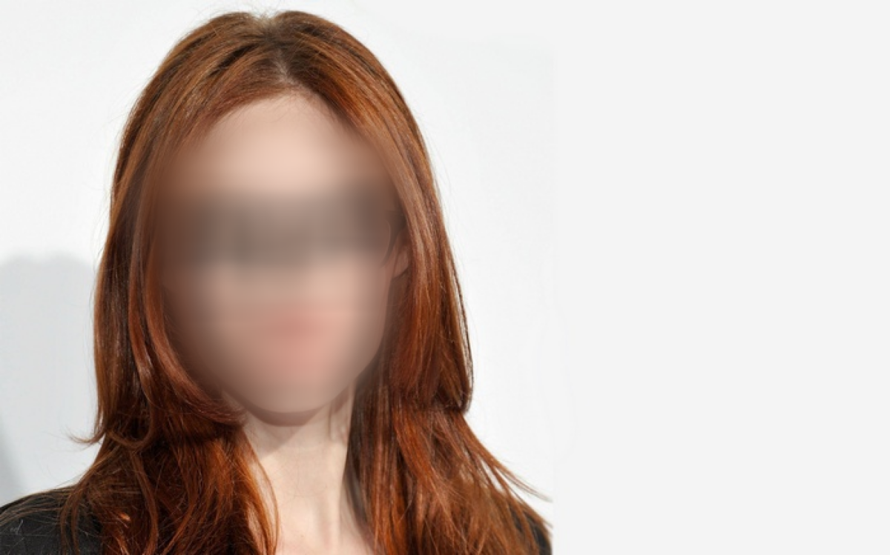

# Smart face blur using 3D Dense Face Alignment


<p align="center">
versus standard face blurring tool proposal
</p>


## 3D Dense Face Alignment project

Realtime face modeling. Computing Basel Face Model, with 38000+ face landmarks!



Paper _Towards Fast, Accurate and Stable 3D Dense Face Alignment_, 2020/09, 
https://arxiv.org/abs/2009.09960

Official PyTorch implementation : https://github.com/cleardusk/3DDFA_V2

```shell script
git clone https://github.com/cleardusk/3DDFA_V2.git
cd 3DDFA_V2
sh ./build.sh
```

## Running face blur demo

```shell script
cd ..
git clone https://github.com/scoutant/face-blur.git
python ../face-blur/blur.py -f ../face-blur/data/students2.jpg
```

## How is computed the blur for each face

For each face the 3ddfa runtime provides a list of 38365 landmarks. For the use case it is enough to pick 1 every 36 landmark.

We can use OpenCV to compute the convex hull which will be our region of interest for the face. Which is smarter than a plain rectangle.
This will be the mask for the face.

Let's see what are the steps to achieve a smooth transition.


    
The convex hull and corresponding OpenCV polygone are merely a binary image.
We can apply a gaussian blur onto the mask itself to compute smooth transition with multiple intermediate shades of grey.

Now we can apply another gaussian blur on the face itself.

We are ready to blend the 2 images accordingly to the mask: hence operating a linear blend with weights provided by the mask.

The kernel size for the gaussian blur does matter. It has to be related to the size of the face region of interest.

OpenCV's findContrours() function will provide the dimension of the bounding box and we can choose the kernel as a proportion of the size.  






